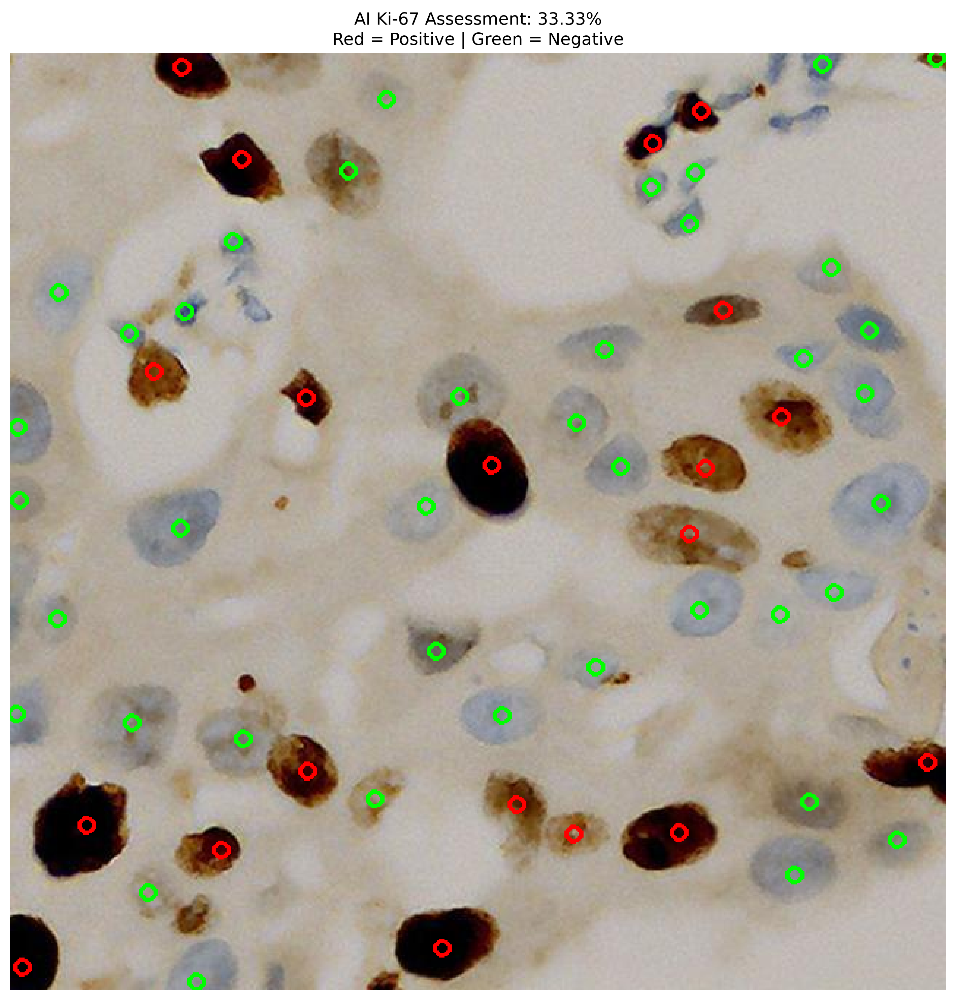

# 🔬 Automated Ki-67 Assessment in Breast Cancer Histopathology using Deep Learning Ensembles

This repository contains an end-to-end deep learning pipeline designed to automate the assessment of the Ki-67 proliferation index in breast cancer histopathology images. 

Rather than simply classifying an image as "cancer" or "not cancer," this system localizes individual cells, classifies them as Ki-67 positive (proliferating) or negative (non-proliferating), and calculates the final clinical Ki-67 score using a Soft-Voting Grand Ensemble of three distinct Convolutional Neural Networks (CNNs). It now features a fully interactive Streamlit web interface for both benchmark testing and live "blind" inference.

## 🎯 Project Overview & Clinical Goal

The Ki-67 index is a crucial cellular marker for cellular proliferation and is used extensively in breast cancer diagnostics to grade tumors and determine treatment plans. 
The mathematical goal of this pipeline is to compute: 
**Ki-67 Score (%) = (Ki-67 Positive Cells / Total Relevant Tumor Cells) × 100**

## 💻 Dual-Mode Web Application (`app.py`)

The pipeline culminates in a professional Streamlit interface featuring two distinct operational modes:

1. **📊 Clinical Benchmark (.h5):** Evaluates the classification ensemble purely against human-expert `.h5` coordinate annotations to prove the 95.50% diagnostic accuracy threshold.
2. **🔍 Live AI Detection (Cellpose):** Performs "blind" end-to-end inference on raw microscope slides. It uses Cellpose to blindly locate cells, scales coordinates, and diagnoses them dynamically without requiring prior human annotations.

## 🧠 The Pipeline Architecture

1. **Data Exploration:** Parsing `.h5` files containing ground-truth cell coordinates.
2. **Patch Extraction:** Dynamically cropping 64x64 pixel patches around annotated cells.
3. **Model Training:** Training 3 state-of-the-art architectures using Transfer Learning.
4. **Soft-Voting Ensemble:** Averaging probability outputs to suppress individual model biases.
5. **AI Cell Detection (Zero-Shot):** Utilizing `Cellpose` (nuclei model) to blindly segment irregular, dense cellular structures across whole slides.
6. **Whole-Slide Inference (UI):** Scanning unseen tissue images, extracting cells on the fly, voting, and overlaying visual markers (Red = Positive, Green = Negative).

## 🏗️ Deep Learning Models & Performance

### 1. The Classification Brain (Grand Ensemble)
The core classification engine uses three distinct architectures to ensure maximum feature diversity:
* **ResNet50:** Utilizes skip-connections to act as a highly accurate, cautious baseline.
* **EfficientNetB0:** Utilizes balanced compound scaling for aggressive, highly sensitive cell detection.
* **DenseNet121:** Utilizes dense feature-reuse to catch complex, subtle cellular textures.

### 📊 Final Test Set Evaluation (54,613 unseen cell patches)

| Architecture | Test Accuracy | False Positives | False Negatives | Positive Recall |
| :--- | :--- | :--- | :--- | :--- |
| **DenseNet121** | 92.50% | 1,941 | 2,153 | 88.32% |
| **EfficientNetB0** | 93.19% | 2,291 | 1,427 | 92.26% |
| **ResNet50** | 94.58% | 1,450 | 1,511 | 91.81% |
| **Grand Ensemble** | **95.50%** | **1,220** | **1,235** | **93.30%** |

*By utilizing a Soft-Voting ensemble, the final pipeline achieved a higher overall accuracy and missed fewer positive cells than any individual model.*

### 2. The Detection Eyes (Cellpose)
To transition from `.h5` dependencies to true blind inference, the pipeline utilizes **Cellpose**.
* **Performance:** Achieves an **85.47% F1-Score** on cell detection (87.72% Precision, 83.33% Recall) when benchmarking predicted masks against raw pathologist coordinates.

## 🔬 Clinical Inference Visualization

The system includes an end-to-end inference script (`9_predict_ki67.py`) that processes raw, uncropped microscope slides.

Example Slide Assessment:

* Total cells detected: 84
* Ground Truth Ki-67: 79.76% (67 Positive, 17 Negative)
* AI Predicted Ki-67: 80.95% (68 Positive, 16 Negative)
* Margin of Error: ~1.19% (Off by a single cell classification)


*Red Circles = Ki-67 Positive (Proliferating) | Green Circles = Ki-67 Negative (Non-proliferating)*

## 📂 Repository Structure

The project was built systematically in 11 stages:
* `0_explore_data.py`: Analyzes the raw BCData file structures and coordinates.
* `1_extract_patches.py`: Crops and standardizes 64x64 dataset patches.
* `2_train_resnet.py` / `3_evaluate_resnet.py`: ResNet50 pipeline.
* `4_train_efficientnet.py` / `5_evaluate_efficientnet.py`: EfficientNetB0 pipeline.
* `6_train_densenet.py` / `7_evaluate_densenet.py`: DenseNet121 pipeline.
* `8_evaluate_ensemble.py`: Soft-voting evaluation matrix on the unseen test set.
* `9_predict_ki67.py`: CLI-based end-to-end clinical inference and OpenCV visualization.
* `test_cellpose.py`: Benchmarks Cellpose spatial detection against pathologist `.h5` files.
* `app.py`: The final Streamlit web interface containing the dual-mode diagnostic pipeline.

## 🚀 How to Run

1. Clone this repository.
2. Ensure you have the `BCData` dataset organized with `images/` and `annotations/` directories.
3. Install dependencies: 
   ```bash
   pip install tensorflow numpy matplotlib opencv-python-headless h5py scikit-learn streamlit cellpose torch torchvision
